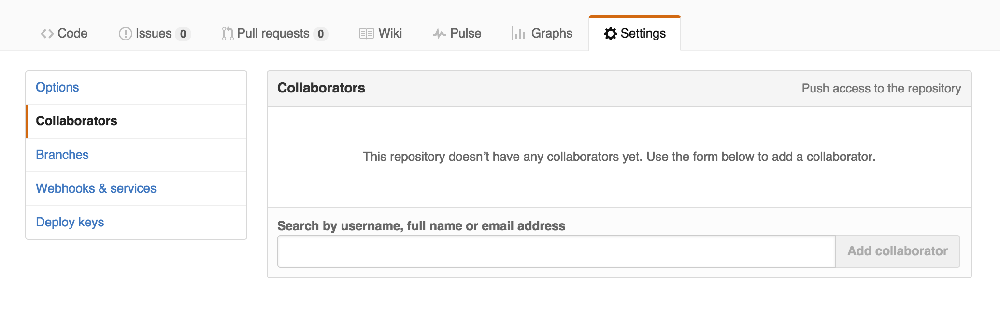

Collaborative Coding
====================

Almost all data-driven research projects involve multiple team members working on the same code-base. In fact, they often involve people working on the same documents ***at the same time***. Luckily, `git` provides a set of tools that ~~easily~~ facilitates project collaboration.

The purpose of this assignment is to provide you with the opportunity to practice using these collaboration tools. Something will likely go wrong, which is really the point. Following this assignment, you'll be prepared to dive into your final project alongside your other team members.

Assignment structure
--------------------

For this assignment, your team will create a simple report of the data collected by the survey everyone took before the course started (names have been removed). The report must include:

-   A paragraph of summary information, citing **at least 3** values calculated from the data.
-   Two charts that display information from the survey (what you visualize is up to you)

Unlike other assignments, you'll keep your code organized in multiple different files. This helps keep your project more modular and clear. You'll create four different files for this project:

-   An `index.Rmd` file that renders your report
-   A file that calculates summary information to be included in your report
-   A file with a function that returns your first chart
-   A file with another function that returns another chart

You should save your `.R` files in a `scripts/` directory. There's more information below about how these files interact.

Expectations
------------

At this point in the quarter, we expect you to be following the *best practices* we've incorporated into the class. This means:

-   Proper use of libraries such as `dplyr` for data wrangling
-   Structuring your code so that if the data changes, you can easily update your **entire** report
-   Leveraging markdown syntax to provide structure to your report
-   Clearly commenting and properly organizing your code
-   Writing functions to encapsulate chunks of code that you use more than once
-   Avoiding the creating of variables that are unnecessary for your analysis/report
-   Creating appropriate labels for your visualizations

Resources
---------

The following resources may be helpful for getting started with your project. As always, google and stackoverflow will likely be needed to supplement this information when you run into specific problems:

-   Git centralized workflow [outline](https://www.atlassian.com/git/tutorials/comparing-workflows/centralized-workflow)
-   Git pull [documentation](https://git-scm.com/docs/git-pull)
-   R plotly graphics [reference](https://plot.ly/r/reference/)
-   RMarkdown [documentation](http://rmarkdown.rstudio.com/)

Here's a tip: when you sit down to start working on a section, begin by pulling in any changes that may have occurred(`git pull origin master --rebase`). Then, once you finish, push your changes up to GitHub (`git push origin master`). This will help minimize the number of conflicts you encounter.

Set-up
------

Unlike previous assignments, in this assignment, you'll initialize your own repository (**do not** fork this one). You can easily create a repository through the GitHub interface:

After creating the repository, you should add each team members as a **collaborator** to the project -- this will allow each member to push to the same remote repository. You can do this by navigating to the **settings** tab:

Once you've created a repository, each team member can `clone` that repository onto their local machine as usual.

    git clone https://github.com/USERNAME/REPO-NAME.git

GitHub Issues
-------------

In order to keep track of who needs to do what, GitHub has created the `issues` tab. Typically, GitHub issues is used on a team to assign tasks and track progress on different parts of the project. You can easily create and assign issues on GitHub's `issues` tab:

For this assignment, you should **assign each components below** to a different group member, and keep track of your progress by closing the issues once you've completed a task. You should do this **from the command line** when you make your commit messages. If you've forgotten how to do that, [this should help](https://help.github.com/articles/closing-issues-via-commit-messages/).

Report Components
-----------------

As described above, you'll be creating four different files. Because the purpose of this assignment is to practice collaboration, **each section should be completed by a different person** (if you are in a group of 5, two people can collaborate on the same section). We'll be checking the commit history to ensure that each section was pushed by a different account. Here is additional information on each section:

### index.Rmd File

Your `index.Rmd` file will be used to actually generate your report. However, it needs the functions written in other files in order to work (see below). To read in a function you've written in another file, you can use the `source` function. This is similar to using the `library` function, but with a file that you've written:

    # Read in functions from another file:
    source("scripts/FILE-NAME.R")

In the Markdown document created, you should leverage the functions written in the other files to do the following:

-   Write a short summary paragraph that includes information calculated by your summary information function
-   Render your first chart
-   Render your second chart

In order to render those charts, you'll need to **read in your data** in your Readme.md file, and **pass your data to those functions**. You can read in the file from it's location in the repository (you **don't** need to copy the file to your repo):

    # Note, this have been moved to a public repo so you can read it without an access token:
    data <- read.csv("https://raw.githubusercontent.com/INFO-498F/a7-survey-data/master/intro_survey_data.csv")

If it isn't clear how to these pieces fit together, reach out to your TA.

### Summary Information File

The first file you should save in your `scripts/` directory should contain a **function** that takes in a dataset as a parameter, and returns a **list** of information about it. For example:

    # A function that takes in a dataset and returns a list of info about it:
    info_function <- function(dataset) {
        ret <- list()
        ret$length <- length(dataset)
        # do some more interesting stuff
        return (ret)
    }

We don't expect you to write a generalizable function that detects rows/columns and asks questions of your dataset. Instead, think of this like a simple analysis you would do on **this** particular dataset, just wrapped in a function. This will allow you to pass your dataset into this function from your `index.Rmd` file.

### Chart file 1

In your second `.R` file, you should write a function that takes in a dataset as a parameter, and returns a visualization of that data. This will allow you to call your charting function from your `index.Rmd` file, keeping your code much easier to read.

### Chart file 2

Similarly to your first charting file, you'll write another function (in another file) that accepts a dataset as a parameter and returns a chart.

Create a gh-pages branch
------------------------

Once you've completed your project, create a `gh-pages` branch so that our final product can be posted on the web. Here's the syntax you'll want to use in your terminal:

<pre>
# Get into your repository
cd YOUR-DIRECTORY-NAME

# Add and commit changes to your current (master) branch
git add .
git commit -m "Commit message goes in here"

# Create and checkout a new branch called 'gh-pages'
git checkout -b gh-pages

# Push all changes (including your new branch) up to GitHub
git push --all
</pre>
You should now see your `index.html` file up on the web at 'your-username.github.io/a5-github-report'.

Submission
----------

Before submitting your assignment, please create a `Readme.md` file **in your repository** to answer the following questions (submit the URL of your group's repo as your assignment):

##### 1. Did you receive any help from others (classmates, etc)? If so, please list who.

> Answer goes here!

##### 2. Approximately how many hours did it take you to complete this challenge?

> Answer goes here!

##### 3. On a scale of 1 (too easy) to 10 (too challenging), how difficult was this challenge?

> Answer goes here!

##### 4. Did you encounter any problems in this challenge we should warn students about in the future? How can we make the challenge better?

> Answer goes here!

Please submit this GitHub repository to <a href="https://canvas.uw.edu/courses/1023398/assignments/3079017" target="_blank">Canvas</a> as your assignment, and thanks for your hard work!
